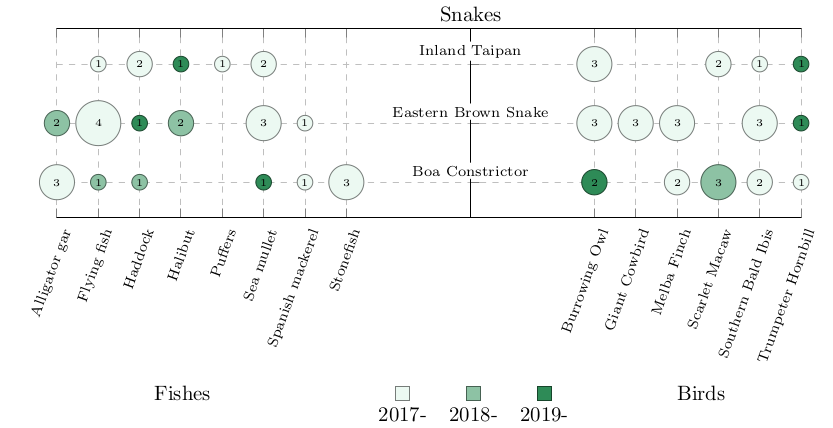

# Bubbleplot

This Latex package provide a command to create a 3 facets bubble plot using [PGF/TikZ](https://www.ctan.org/pkg/pgf).

Note that the CSV file and some of the keys can be generated automaticaly by the [bubble_plot](https://github.com/Zar-rok/bubble_plot) Python module.

## Example

The following figure display a bubble plot generated with the following [Latex code](example/example.tex) using the following [dummy data](example/example.csv).



Bubble plot are used, for instance in a `Systematic Mapping Study`. See [Petersen, Kai, et al. "Systematic mapping studies in software engineering." Ease. Vol. 8. 2008](https://www.researchgate.net/profile/Michael_Mattsson/publication/228350426_Systematic_Mapping_Studies_in_Software_Engineering/links/54d0a8e90cf20323c218713d/Systematic-Mapping-Studies-in-Software-Engineering.pdf) for a presentation of this methodology.

## Documentation

The main command defined by the `bubbleplot` Latex package is `\bubbleplot`:

``` latex
\documentclass{standalone}
\usepackage{bubbleplot}

\definecolor{2017}{rgb}{0.9248648648648647, 0.9751351351351352, 0.947027027027027}
\definecolor{2018}{rgb}{0.5511687604559576, 0.7592733771834118, 0.6429138065401041}
\definecolor{2019}{rgb}{0.1803921568627451, 0.5450980392156862, 0.3411764705882353}

\pgfplotsset{
    colormap={yearcolor}{
        color=(2017),
        color=(2018),
        color=(2019),
    }
}

\begin{document}
\bubbleplot[%% KEYS
    width=7mm,
    height=1cm,
    xmin=-10,
    xmax=8,
    ylabel=Snakes,
    meta=nbr,
    x field=x,
    enlarge y limits=0.3,
    x index field=ix,
    y field=iy,
    y index field=iy,
    year field=years,
    year x shift=-1.4cm,
    year y shift=3.5cm,
    year padding=12,
    x left label=Fishes,
    x left label shift=3cm,
    x right label=Birds,
    x right label shift=2cm,
]
{example.csv} %% CSV FILE NAME
{2017, 2018, 2019} %% YEARS
\end{document}
```

- `YEARS` is the ordered sequence of years used in the plot.
- `CSV FILE NAME` is the CSV file generated by the Python module.
- `KEYS` are the following `pgfkeys` keys:
    - `width` and `height` define the width and height of the plot.
    - `xmin` and `xmax` define the smallest and biggest value in the x axis.
    - `ylabel` is the label of the facet on the y axis.
    - `enlarge y limits` is the spacing between bubbles and the horizontal plot limits, default value `0.2`.
    - `x field` is the labels on the x axis.
    - `x index field` is the x axis index of bubbles.
    - `y field` is the labels on the y axis `y`.
    - `y index field` is the y axis index of the bubbles.
    - `meta` is the occurrence displayed in each bubble.
    - `year field` is the year related score mapped to colour.
    - `year x shift` and `year y shift` allows to shift the year legend on the x axis and y axis.
    - `year padding` define the padding between each year in the legend, default value `12`.
    - `x left label` and `x right label` define the facet label on the left and right parts of the x axis.
    - `x left label shift` and `x right label shift` allows to place the left and right labels relatively to the year legend.

Note that keys without default values must be set by the user, else the package will raise an error.
